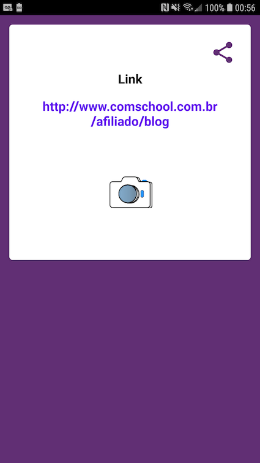

# QR-Code-Scanner
Projeto publicado na playstore!

Alguns devices nao tem leitor de QR code nativo.
A ideia do projeto é tornar mais rápida a leitura de QR code em restaurantes e apresentacões.
Hoje os apps que estão disponíveis no mercado são lentos e cheios de propaganda, o *MY QR Code* é totalmente free e está disponível na playstore.

Features disponíveis:

1. Leitor de código de barras rápido.
2. Histórico de leituras com persistencia em um banco local.

